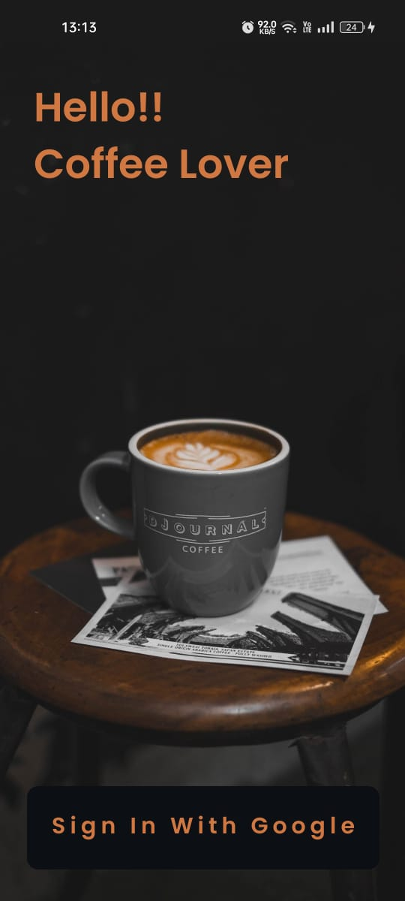
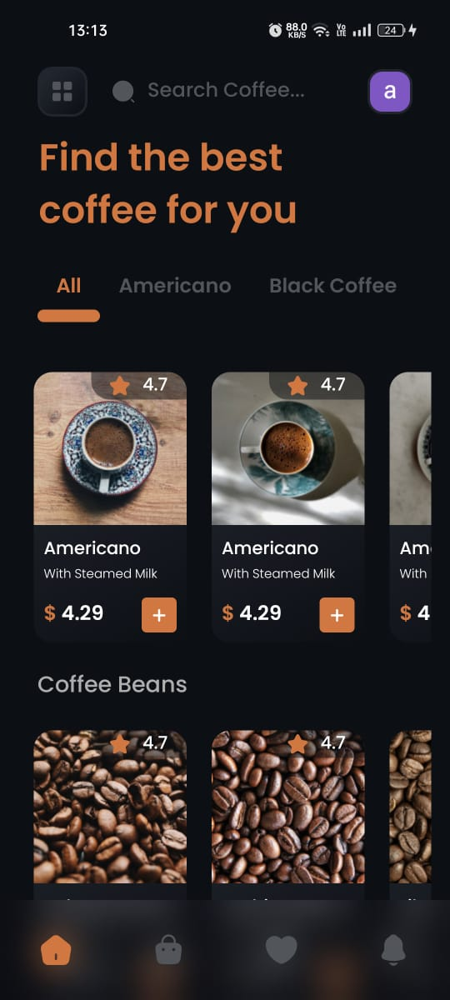
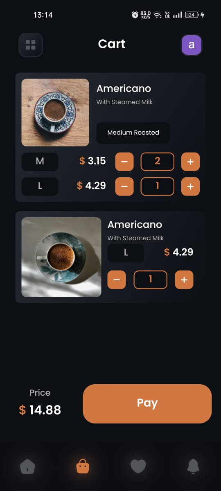
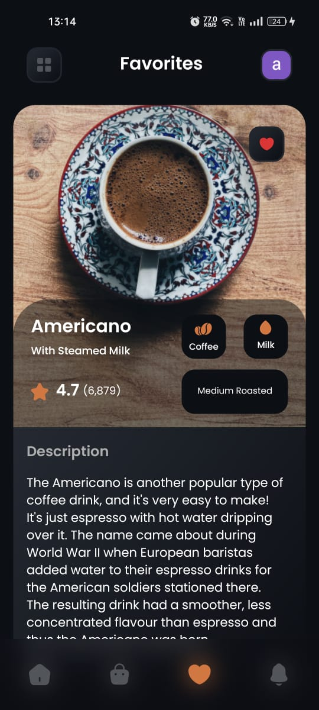
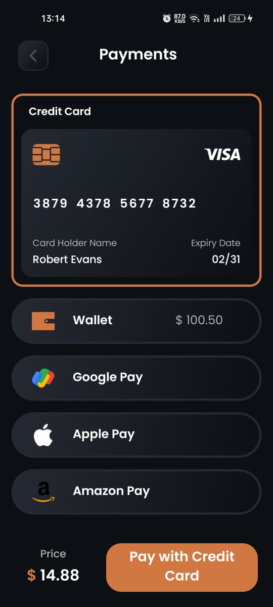
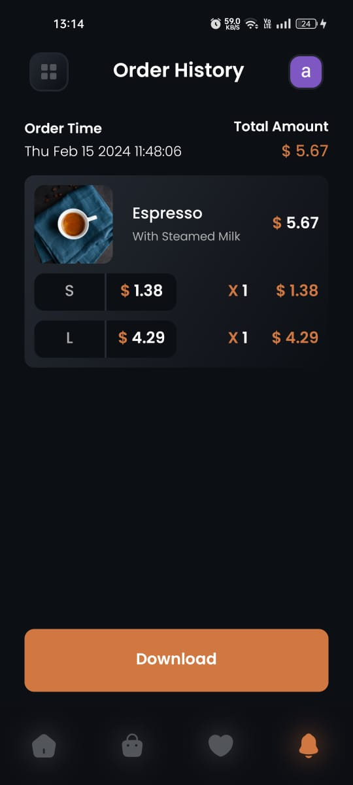

### This is a Coffee and beans shop mobile application project, developed in React Native and Firebase.
### You can download and have fun with the app in your android device:-

```
    - In your android device, download the files that are inside the "apk_files" folder (in the root directory).
    - Install the app by running the apk file in your android device.
```

### UI of the application:-

<p align="left" display="flex" flex-direction="row" gap="100">
  
  
  
  
  
  
</p>
